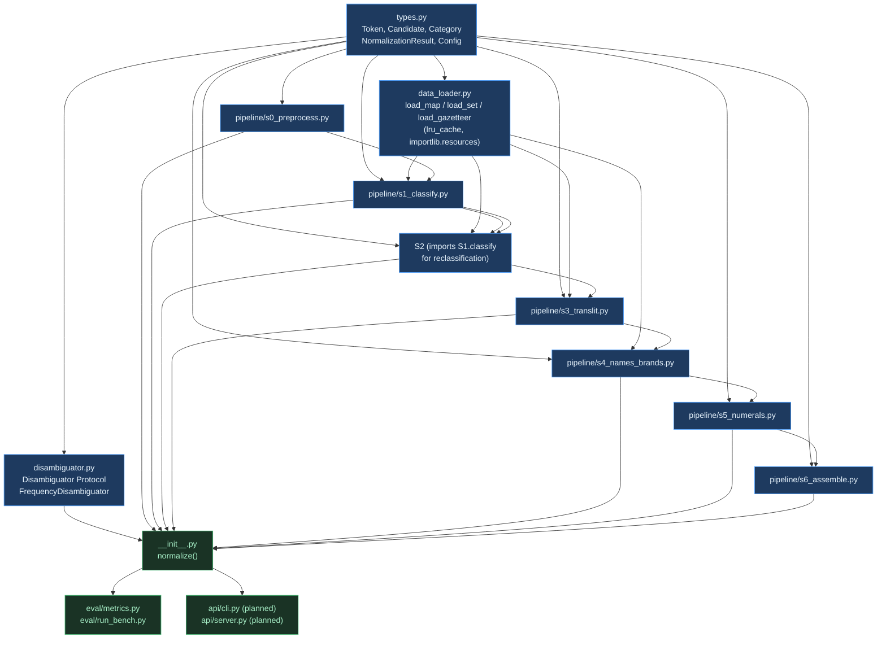

# OpenHinglish — Architecture

> Status: early-functional (deterministic pipeline complete; ~1,400+ lexicon entries; 51 tests pass).
> This document is authoritative for the current implementation and covers the planned shape of V1–V4.
> Read alongside [BENCHMARK.md](BENCHMARK.md) (evaluation methodology) and [DATASETS.md](DATASETS.md) (data provenance).

---

## 1. System Overview

OpenHinglish is a **deterministic, explainable, CPU-only Roman-Hinglish text normalization engine**.
It is TTS-agnostic infrastructure: the output is a structured data object, never a raw string piped
directly to audio synthesis.

### What it produces

Given informal Roman-Hinglish input, the engine emits **two complementary text outputs** plus
structured per-token metadata:

| Output | Purpose | Example |
|---|---|---|
| `display` | Human-readable; English words / brand names stay Latin | `भाई कल मेरा interview है Paytm में` |
| `tts` | Fully resolved for a Devanagari-native TTS (IndicF5, Indic-Parler-TTS) | `भाई कल मेरा इंटरव्यू है पे-टी-एम में` |

Word order is **preserved**. The engine is not a translator; it normalizes, classifies, and
resolves surface forms without reordering grammar.

### Design principles

1. **Output is never a single string.** `confidence` and `alternatives` (n-best) are first-class
   outputs. Every consumer can inspect rank-2 and rank-3 candidates.
2. **`display_form` and `tts_form` are always separate.** A Devanagari-native TTS cannot reliably
   voice `Paytm`; the engine carries the resolved pronunciation (`पे-टी-एम`) alongside the
   human-legible Latin form.
3. **Every decision is traceable.** Each `Token` accumulates a `trace: list[str]` — one entry per
   stage that touched it — recording which lexicon, rule, or fallback fired.
4. **Community-fixable without retraining.** Errors in transliteration or classification are
   corrected by editing TSV data files; no Python code change is required.
5. **Deterministic.** Identical input + identical data files + identical `Config` ⇒ identical output.
   No randomness, no runtime model weights, no GPU dependency.
6. **Path A → C commitment.** V1 is fully deterministic (Path A). The `Disambiguator` Protocol seam
   exists so a learned layer (Path C, V3) can be plugged in without a pipeline rewrite.

---

## 2. Data-Flow Diagram

The 7-stage pipeline operates on a list of `Token` objects that are progressively annotated.
Tokens are never re-parsed from strings between stages; the annotation object is the only carrier.

```mermaid
flowchart TD
    INPUT["raw text\n\"bhai kal mera intv h paytm me\""]

    S0["S0 Preprocess / Tokenize\nUnicode NFC · regex split\nemit Token{surface, span, category=UNKNOWN}"]
    S1["S1 Classify\nlexicon + shape priors → ranked candidates\n→ category, confidence, alternatives"]
    S2["S2 Spell-normalize\n(a) abbrev expansion: intv→interview\n(b) conservative typo fix (cutoff 0.85)"]
    DISAMBIG["Disambiguator.resolve()\nV1: no-op FrequencyDisambiguator\nV3: learned model plugs here"]
    S3["S3 Transliterate\nHINDI_ROMAN: lookup roman_hindi.tsv → Devanagari\nfallback: akshara rule engine\nENGLISH: lookup english_tts.tsv for tts_form only"]
    S4["S4 Names / Brands\ngazetteer match + casing/context guard\nsets display_form + tts_form for entities"]
    S5["S5 Numerals / Time / Acronyms\ndigits → Hindi/English word-form (tts_form)\nALL-CAPS 2-5 chars → letter-by-letter Devanagari"]
    S6["S6 Assemble\njoin display_form tokens → display string\njoin tts_form tokens → tts string\naggregate confidence"]

    DISPLAY["display output\n\"भाई कल मेरा interview है Paytm में\"\n(English/brands stay Latin)"]
    TTS["tts output\n\"भाई कल मेरा इंटरव्यू है पे-टी-एम में\"\n(fully resolved for Devanagari TTS)"]

    INPUT --> S0 --> S1 --> S2 --> DISAMBIG --> S3 --> S4 --> S5 --> S6
    S6 --> DISPLAY
    S6 --> TTS

    classDef stage fill:#1e3a5f,color:#e8f4fd,stroke:#4a9eff
    classDef io fill:#1a3325,color:#a8f0c8,stroke:#3dba6f
    classDef seam fill:#3d2a1a,color:#ffd5a0,stroke:#ff9944
    class S0,S1,S2,S3,S4,S5,S6 stage
    class INPUT,DISPLAY,TTS io
    class DISAMBIG seam
```

**Worked example token trace — `intv`:**

1. S0 emits `Token(surface="intv", category=UNKNOWN)`
2. S1 finds no lexicon hit → `UNKNOWN, confidence=0.1`
3. S2 finds `intv` in `sms_abbrev.tsv` → `display_form="interview"`, reclassifies → `ENGLISH, confidence~0.75`
4. S3 finds `interview` in `english_tts.tsv` → `tts_form="इंटरव्यू"` (display stays `interview`)
5. S6 contributes `interview` to `display`, `इंटरव्यू` to `tts`

---

## 3. The Token Annotation Model

All pipeline state is carried in a list of `Token` dataclass instances. No intermediate strings
are passed between stages.

### `Token` field table

| Field | Type | Set by | Description |
|---|---|---|---|
| `surface` | `str` | S0 | Original whitespace-delimited substring from the input. Never mutated after S0. |
| `start` | `int` | S0 | Byte/char offset of `surface[0]` in the original input string. |
| `end` | `int` | S0 | Byte/char offset one past the last char of `surface`. |
| `category` | `Category` | S0 initial; S1 updates; S2/S4 may reclassify | The winning category from the `Category` enum (see below). |
| `display_form` | `str` | S0 copies `surface`; S2/S3/S4/S5 update | The human-readable resolved form. English words and brand names stay in their natural script (Latin). |
| `tts_form` | `str` | S0 copies `surface`; S3/S4/S5 update | The pronunciation form for Devanagari-native TTS. Brands like `Paytm` become `पे-टी-एम`; English words become their Devanagari phonetic rendering. |
| `confidence` | `float ∈ [0,1]` | S1 writes; S4 may override | Probability-like score of the winning candidate. Sourced from frequency priors (S1) or fixed gazetteer priors (S4: 0.92). |
| `alternatives` | `list[Candidate]` | S1 writes; S2/S4 prepend | N-best ranked list of non-winning candidates, sorted descending by `score`. Maximum length governed by `Config.nbest_k`. |
| `trace` | `list[str]` | Every stage appends | Human-readable audit trail, one entry per stage that touched the token. Enables debugging and evaluation attribution. |

### `display_form` vs `tts_form`

The distinction is not cosmetic — it is the engine's core value:

- **`display_form`** answers: "what should a human reader see?" English words remain Latin because
  mixing scripts in a subtitle or chat message is natural and legible. Brand names stay in their
  registered casing (`Paytm`, not `पे-टी-एम`).
- **`tts_form`** answers: "what phoneme sequence should a Devanagari TTS engine be given?"
  `interview` → `इंटरव्यू`; `Paytm` → `पे-टी-एम`; `4` → `चार`. The TTS never sees the Latin surface.

A token where `display_form == tts_form` is the common case for pure Hindi tokens (e.g. `भाई`),
but the equality is never assumed — stages always write both fields independently.

### `alternatives` / n-best

Each element is a `Candidate(category, display_form, tts_form, score)`. Candidates are sorted
descending. When a stage overrides the winning form, it prepends the displaced candidate to
`alternatives` so no information is lost. This enables downstream consumers (e.g. a V3 context
model) to revise the choice without re-running the pipeline.

### `confidence`

S1 computes confidence from frequency priors: English tokens use `min(0.95, 0.4 + freq/200000)`;
Hindi-Roman tokens use `min(0.9, 0.5 + freq/24000)`. Gazetteer matches in S4 are assigned 0.92
(high but not 1.0, acknowledging the casing/context guard can be wrong). The aggregate
`NormalizationResult.confidence` is the mean of all non-PUNCT token confidences.

### `trace`

Each stage appends strings like `"S1: classified ENGLISH (score=0.75, 2 alt)"`,
`"S3: translit lookup bhai -> भाई"`, `"S4: entity BRAND paytm -> Paytm/पे-टी-एम"`. This field
is the primary mechanism for evaluation attribution, contributor debugging, and honest reporting
of where the pipeline is uncertain.

### Supporting types

```
Category (enum): HINDI_ROMAN | HINDI_DEVA | ENGLISH | NAME | BRAND |
                  NUMBER | DATE | TIME | ACRONYM | PUNCT | EMOJI | URL | UNKNOWN

Candidate:  category: Category
            display_form: str
            tts_form: str
            score: float

NormalizationResult:  input: str
                      display: str
                      tts: str
                      confidence: float
                      tokens: list[Token]

Config:  number_words_lang: str   # "hindi" | "english"  (default "hindi")
         nbest_k: int             # max alternatives to retain (default 3)
```

---

## 4. Stage-by-Stage Responsibilities

### S0 — Preprocess / Tokenize (`pipeline/s0_preprocess.py`)

**Input:** raw Unicode string.

**Output:** `list[Token]` with `surface`, `start`, `end`, initial `category`, and a first `trace` entry.

**Key logic:**

1. Unicode NFC normalization (prevents composed vs decomposed Devanagari mismatches).
2. Regex tokenizer with priority alternation: URLs first, then word characters (Latin + Devanagari),
   then digit runs (with embedded `.`/`,`/`:`), then emoji ranges, then single punctuation chars.
3. Initial `category` assignment from token shape: URL → `URL`; digit-leading → `NUMBER`;
   all-Latin or all-Devanagari word → `UNKNOWN` (S1 will refine); emoji → `EMOJI`; else → `PUNCT`.
4. `display_form` and `tts_form` are initialized to `surface`; downstream stages overwrite as needed.

**Data files used:** none.

---

### S1 — Classify (`pipeline/s1_classify.py`)

**Input:** tokens from S0.

**Output:** tokens with `category`, `confidence`, `alternatives` populated.

**Key logic:**

1. Skip structural tokens (`PUNCT`, `EMOJI`, `URL`, `NUMBER`).
2. Devanagari-script tokens receive `HINDI_DEVA, confidence=1.0` immediately.
3. For Roman tokens, build a `Candidate` list by probing four lexicons in priority order:
   - `brands.tsv` gazetteer → `BRAND, score=0.9`
   - `names.tsv` gazetteer → `NAME, score=0.85`
   - `roman_hindi.tsv` → `HINDI_ROMAN, score=min(0.9, 0.5 + freq/24000)`
   - `english_freq.tsv` → `ENGLISH, score=min(0.95, 0.4 + freq/200000)`
4. Sort candidates by score descending; take top-1 as winner, store the rest (up to `nbest_k-1`)
   in `alternatives`. Ambiguous tokens (e.g. `kal` found in both roman-hindi and english) retain
   all candidates for downstream resolution.
5. Tokens with zero lexicon hits → `UNKNOWN, confidence=0.1`.

**Data files used:** `lexicons/english_freq.tsv`, `lexicons/roman_hindi.tsv`,
`gazetteers/names.tsv`, `gazetteers/brands.tsv`.

---

### S2 — Spell-normalize (`pipeline/s2_spellnorm.py`)

**Input:** classified tokens from S1.

**Output:** tokens with abbreviated or misspelled `surface` values corrected in `display_form`/`tts_form`;
original form preserved as an `alternatives` entry.

**Key logic:**

1. **Abbreviation expansion (deterministic):** if `surface.lower()` is a key in `sms_abbrev.tsv`,
   replace `display_form` and `tts_form` with the expansion. Example: `intv → interview`,
   `h → है` (via the roman-hindi path after reclassification).
2. Skip tokens already in a trusted lexicon or in `_SKIP` categories (`PUNCT`, `EMOJI`, `URL`,
   `NUMBER`, `HINDI_DEVA`, `NAME`, `BRAND`). This is the over-correction guard.
3. **Conservative typo fix:** use `difflib.get_close_matches(surface, english_vocab, cutoff=0.85)`.
   Only fires for near-identical edits to English words. The original surface is pushed into
   `alternatives` with `confidence - 0.1`.
4. **Reclassification:** if any token's `display_form` diverged from `surface`, re-run S0+S1 on
   the corrected form and copy the resulting `category`/forms back.

**Data files used:** `lexicons/sms_abbrev.tsv`, `lexicons/english_freq.tsv`,
`lexicons/roman_hindi.tsv`.

**Note on coupling:** S2 imports S1's `classify` function for the reclassification path. This is
an acknowledged coupling that is acceptable in V1 but should be watched as both stages evolve.
See §8 (Risks).

---

### S3 — Transliterate (`pipeline/s3_translit.py`)

**Input:** spell-normalized tokens.

**Output:** tokens with `display_form` and `tts_form` set to Devanagari for `HINDI_ROMAN` tokens;
`tts_form` set to Devanagari phonetics for `ENGLISH` tokens with known TTS mappings.

**Key logic:**

1. `HINDI_ROMAN` tokens:
   - Probe `roman_hindi.tsv` for the exact lowercased `display_form`. On hit: set both `display_form`
     and `tts_form` to the Devanagari value.
   - On miss: run `akshara_fallback()` — a rule-based syllabification engine using ordered
     consonant/vowel tables (longest-match, with halant `्` insertion between adjacent consonants).
     This ensures the pipeline never crashes on OOV tokens; accuracy on arbitrary OOV is low.
2. `ENGLISH` tokens: probe `english_tts.tsv`. On hit: set **only `tts_form`** — `display_form`
   stays Latin. (`interview` stays `interview` in display; becomes `इंटरव्यू` in tts.)
3. All other categories pass through unchanged.

**Data files used:** `lexicons/roman_hindi.tsv`, `lexicons/english_tts.tsv`.

**The display/tts divergence point:** this is where the two output paths structurally split.
After S3, a `HINDI_ROMAN` token has the same Devanagari in both forms; an `ENGLISH` token has
Latin in `display_form` and Devanagari in `tts_form`.

---

### S4 — Names / Brands (`pipeline/s4_names_brands.py`)

**Input:** transliterated tokens.

**Output:** tokens with gazetteer-resolved `display_form` and `tts_form` for identified entities;
casing/context guard prevents over-firing.

**Key logic:**

1. For each token, probe `brands.tsv` first, then `names.tsv` (brands take precedence).
2. **Casing/context guard (`supports_entity`):** the entity override fires only when at least
   one of these conditions holds: token is sentence-initial; token is title-cased; token is already
   classified as `NAME`/`BRAND`/`UNKNOWN`; token category is `BRAND` (brands always override).
3. If the guard passes: set `display_form = entity.display`, `tts_form = entity.pron_deva`,
   `confidence = 0.92`; push the displaced form into `alternatives`.
4. If the guard fails: entity is added as a candidate in `alternatives` only. `aman` (peace) vs
   `Aman` (name) is correctly handled this way.
5. This stage is the **primary seam for Slice #2** (the full Names/Brands DB). In V1, the gazetteers
   are tiny seeds (4 names, 4 brands); in V1/V2, Wikidata-derived data plugs in without code change.

**Data files used:** `gazetteers/names.tsv`, `gazetteers/brands.tsv`.

---

### S5 — Numerals / Time / Acronyms (`pipeline/s5_numerals.py`)

**Input:** entity-resolved tokens.

**Output:** tokens with `tts_form` set to word forms for numbers and letter-by-letter Devanagari
for acronyms.

**Key logic:**

1. `NUMBER` tokens whose `surface.isdigit()`: convert integer to word form via
   `number_to_hindi_words()` (covers 0–10 and 100 in V0.1; full coverage deferred) or
   `_number_to_english_words()`, depending on `Config.number_words_lang`. Sets only `tts_form`;
   `display_form` retains the digit.
2. Acronym detection: token is all-uppercase alpha, length 2–5, not already classified as a known
   entity → `ACRONYM`; `tts_form` is the letter-by-letter Devanagari expansion using a 26-letter
   lookup table (e.g. `RBI` → `आर बी आई`).
3. Date/time grammar, currency, phone patterns: partially planned in the spec, not yet implemented
   in V0.1. Category enum reserves `DATE` and `TIME` for future use.

**Data files used:** none (logic is code-side in V0.1; future time/date grammar may use a rules TSV).

---

### S6 — Assemble (`pipeline/s6_assemble.py`)

**Input:** fully annotated token list.

**Output:** `NormalizationResult` with `display`, `tts`, and aggregate `confidence`.

**Key logic:**

1. Join `display_form` values with single spaces, with a no-space rule for specific punctuation
   characters before which no space is inserted (`。`, `।`, `,`, `.`, `!`, `?` etc.).
2. Identical join logic for `tts_form` values.
3. Aggregate `confidence = mean(token.confidence for token where category != PUNCT)`.
4. Appends `"S6: assembled into display/tts"` to every token's trace.
5. Returns immutable `NormalizationResult`; the token list is included for full inspection.

**Data files used:** none.

---

## 5. Extension Points

### The pluggable `Disambiguator` Protocol

```python
class Disambiguator(Protocol):
    def resolve(self, tokens: list[Token], config: Config) -> list[Token]: ...
```

The `normalize()` entry point in `__init__.py` holds a module-level `_DISAMBIGUATOR` instance and
calls `_DISAMBIGUATOR.resolve(tokens, config)` between S2 and S3. In V1 this is
`FrequencyDisambiguator`, a no-op that returns tokens unchanged (S1 already ranked by frequency
prior, so the ordering is already the best deterministic guess available).

**Extension mechanism:** replace `_DISAMBIGUATOR` with any object implementing `resolve`. Because
the interface is a `Protocol`, not an ABC, there is no inheritance required — any class with the
right method signature qualifies. A V3 learned disambiguator is thus a drop-in.

**What the seam enables at V3:** the learned model sees the full token list with all `alternatives`
intact (S1, S2, S4 never discard candidates, only reorder them). It can swap rank-1 and rank-2
candidates based on cross-token context — handling classic Hinglish ambiguities like `kal`
(yesterday vs tomorrow), `main` (I vs English "main"), `to` (then/so vs English "to") — and write
the result back into `category`/`display_form`/`tts_form` before S3 consumes the tokens.

### TSV data files as a no-code extension surface

All lexicons and gazetteers are TSV files packaged alongside the Python source. A contributor
who knows no Python can:

- Add a new Roman-Hindi word by appending a row to `roman_hindi.tsv`.
- Add a new brand pronunciation by appending to `brands.tsv`.
- Fix a wrong SMS expansion in `sms_abbrev.tsv`.
- The change takes effect on the next `pip install` without touching any `.py` file.

The `data_loader.py` functions (`load_map`, `load_set`, `load_gazetteer`) use `lru_cache` so each
file is parsed exactly once per process. Adding rows never changes the interface.

### Path A → C: where the learned layer plugs in at V3

```
V1 (Path A, current):
  S2 output → FrequencyDisambiguator (no-op) → S3

V3 (Path C):
  S2 output → LearnedDisambiguator.resolve(tokens, config) → S3
                 │
                 ├── context window over full token list
                 ├── reads token.alternatives (n-best from S1/S2)
                 ├── may promote rank-2 candidate to rank-1
                 └── writes token.category / display_form / tts_form
```

Critically: S3 through S6 are unchanged. The learned layer does not produce Devanagari — it
selects from the candidates already computed. Transliteration, gazetteer lookups, and numeral
expansion remain deterministic and auditable regardless of how the disambiguator ranks things.

---

## 6. Future Subsystems

### Slice #2 — Names / Brands Database (V1 → V1 tail / V2)

**What it is:** a large, well-provenance-tracked gazetteer of Indian personal names, place names,
and brand names, each with a canonical `display` form and a Devanagari `pron_deva` pronunciation.
Seeds in V0.1 total 4 names + 4 brands. V1 target: 5,000+ names, 500+ brands.

**How it attaches:** purely as data. `gazetteers/names.tsv` and `gazetteers/brands.tsv` are read
by S1 and S4 via `load_gazetteer()`. Growing the files is the entire integration — no code change.
Wikidata-derived entries (CC0 license) are the primary V1 source.

**Dependency note:** a larger gazetteer increases S4 match rate but also increases false-positive
entity overrides if the casing/context guard is not robust. The guard logic in S4 will need to
be hardened before the V1 gazetteer expansion lands.

### Slice #3 — IndianTTSBench (V1 tail / standalone)

**What it is:** a human-verified benchmark of 300–500 Roman-Hinglish sentences with reference
`display` and `tts` forms, spanning: code-switch, names, brands, numerals, dates, addresses, SMS
abbreviations, and classic ambiguity traps. The `eval/bench_mini/sentences.tsv` file (6 rows in
V0.1) is the seed.

**How it attaches:** `eval/run_bench.py` reads `sentences.tsv`, calls `normalize()`, and reports
per-category exact-match and CER via `eval/metrics.py`. Growing the bench is adding rows to the
TSV. The benchmark is designed to be a community-maintained public artefact (IndianTTSBench full
standard, V5 roadmap goal).

**Warning:** the current 0.93 display EM (0.88 TTS) on 43 single-author sentences is an early signal,
not a production capability claim. Real accuracy on arbitrary, multi-annotator Hinglish is expected to
be lower until V1 lexicons are scaled.

### Learned Disambiguator (V3 — "Context-aware")

**What it is:** a lightweight model (target: CPU-only, <100 MB, no GPU at inference) that performs
context-aware token resolution and NER improvements. Candidate approaches: CRF over token+context
features, or a small Transformer encoder fine-tuned on a Hinglish disambiguation dataset.

**How it attaches:** implements `Disambiguator.resolve(tokens, config) -> list[Token]`. Installed
as an optional extra (`pip install openhinglish[context]`). The base package remains zero-ML.

**Constraint:** any ML used during training (e.g. IndicXlit for data augmentation) must be
offline-only. At inference, the installed model is a static checkpoint — no training pipeline,
no internet call, no GPU.

### Language Packs (V2 — "Multilingual frontends")

**What it is:** per-language data extensions (Marathi, Punjabi, Gujarati, Bengali, Tamil, Telugu)
that reuse the same 7-stage pipeline with language-specific lexicons, translit tables, and G2P rules.

**How it attaches:** by convention, each language pack lives under
`src/openhinglish/data/lexicons/<lang>/` and `src/openhinglish/data/gazetteers/<lang>/`.
A `Config(language="mr")` parameter routes `data_loader` to the correct subfolder.
The pipeline stages themselves require no modification; the data-routing logic is localized to
`data_loader.py`.

**Packaging:** language packs may ship as separate optional packages
(`openhinglish-marathi`, etc.) to keep the base install small, or as extras within the monorepo.
This decision is deferred to V2 design.

### Ecosystem Adapters (V4 — "Integrations")

**What it is:** thin adapter modules that bridge the `NormalizationResult` contract to specific
downstream systems: IndicF5 TTS, CosyVoice2, ASR post-processing, chatbot middleware, search
indexers, a hosted REST API, and a JS/WASM port.

**How it attaches:** adapters live in a separate `openhinglish-adapters` repo (or `src/adapters/`
within the monorepo). They import `openhinglish.normalize` and transform the output — they never
modify the core pipeline. The JS/WASM port is a compile-time concern (PyScript or manual port)
and does not affect the Python architecture.

---

## 7. Dependency Graph



**Key observations:**

- `types.py` has zero in-package imports; it is the pure foundation that everything else builds on.
- `data_loader.py` depends only on `types.py` (for the `Entity` dataclass) and stdlib.
- Stage files are strictly ordered; no stage imports from a later stage **except** S2, which
  imports S1's `classify` function for the reclassification path (see §8, Risk R3).
- `eval/` and `api/` depend only on `__init__.py` (the public surface), never on internals.

---

## 8. Challenged Assumptions / Risks / Open Questions

These are not concerns for later — they are the honest state of the project as of V0.1.

**R1 — Skeleton is not a product.**
The 7-stage pipeline runs on 13 Roman-Hindi words, 6 abbreviations, 4 names, 4 brands.
Real-world Hinglish coverage is approximately zero. Every "architecture is complete" claim
must be qualified: the infrastructure is complete; the data is not.

**R2 — Does the linear pipeline limit cross-token disambiguation?**
The current architecture processes tokens independently within each stage (the loop over tokens
has no cross-token state). This works for transliteration, but `kal` (yesterday/tomorrow) requires
knowing surrounding context words. The `Disambiguator` seam is designed for this, but until V3
the pipeline is fundamentally single-pass and context-blind. This is an acceptable V1 trade-off
that must be stated, not hidden.

**R3 — S2 imports S1 (`classify`) for reclassification.**
The reclassification path in S2 calls `classify()` from S1 on shadow tokens. This creates a
bi-directional dependency between S1 and S2 that could cause import cycles or maintenance friction
if either stage evolves significantly. It should be refactored into a shared utility function at V1.

**R4 — Coupling of spell-normalization and transliteration.**
`intervew` (misspelled English) must be recognized as English and protected from transliteration.
The current architecture relies on S2 reclassifying typo-corrected tokens before S3 sees them.
If S2 fires incorrectly (false typo detection), a Hindi word could be pushed through the English
TTS path. The `cutoff=0.85` guard is conservative but not infallible.

**R5 — The bench score is a limited signal at current scale.**
0.93 display EM (0.88 TTS) on 43 single-author sentences proves the pipeline works and surfaces
real weak spots (address, code-switch); it does not prove correctness on arbitrary real text. Until
the bench grows to 300+ human-verified, multi-annotator sentences covering out-of-vocabulary tokens
and ambiguity traps, the metric must always be cited with that caveat.

**R6 — Bus factor = 1 is the top existential risk.**
A 5-year infrastructure project with a solo maintainer is not a project — it is a prototype that
happens to be open-sourced. Contributor growth, governance documentation, and a second trusted
maintainer are higher priority than most technical features on the roadmap.

**R7 — License provenance can sink the project.**
Dakshina is CC-BY-SA-4.0 (ShareAlike). Any `roman_hindi.tsv` content derived from Dakshina must
carry the same license, not be relabeled MIT. If the V1 lexicon scaling uses Dakshina as a source,
the data file's license must be documented in `DATA_LICENSES.md` and the file must be kept in a
clearly-segregated path with its own `LICENSE`. Failing to do this before the first PyPI release
could force a version withdrawal.

**R8 — V3 ML + CPU-only constraint is unvalidated.**
The commitment is that the learned disambiguator is CPU-only and `<100 MB`. Whether a model
capable of resolving Hinglish ambiguity fits within those constraints is unverified. CRF-based
approaches are likely fine; Transformer-based approaches need careful benchmarking before V3 design.

**R9 — Demand is unproven.**
The project's wedge is "no open-source tool handles Roman-Hinglish well." This is currently
substantiated by qualitative evidence. A killer integration (one popular TTS or chatbot openly
using OpenHinglish) would validate the demand assumption in a way that documentation cannot.
Without it, the project risks being a well-engineered solution to a problem people solve
ad-hoc with regex and do not actually need standardized.
